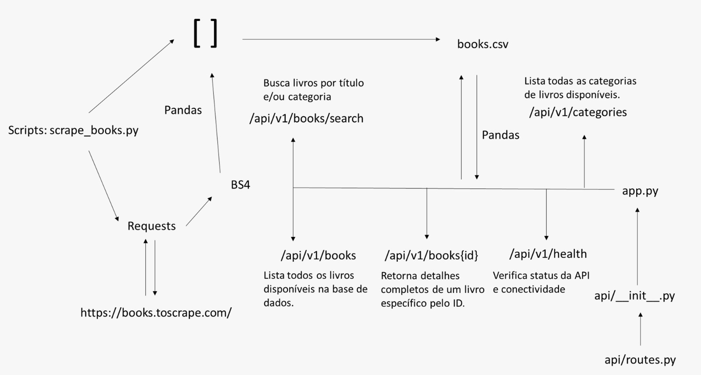

# README — FIAP Tech Challenge — Books API

## Visão geral do projeto
Este projeto implementa um **pipeline de dados** e uma **API RESTful** para disponibilizar uma base de livros (extraída de `https://books.toscrape.com/`) para consumo por cientistas de dados e sistemas de recomendação. O objetivo é oferecer os dados de forma simples e escalável, com endpoints core para listagem, busca, detalhe e categorias, além de documentação automática via Swagger.

Arquivos principais do repositório:
- `app.py` — arranque da aplicação.
- `api/` — package com a API (`__init__.py`, `routes.py`).
- `scripts/scrape_books.py` — script de scraping.
- `data/books.csv` — CSV com os livros extraídos.

## Arquitetura
1. **Ingestão / Scraping** — `scripts/scrape_books.py` coleta dados de `books.toscrape.com` e salva no CSV.
2. **Processamento** — API carrega CSV e expõe endpoints JSON.
3. **API Flask + Flasgger** — Rotas RESTful, documentação Swagger.
4. **Consumo** — Sistemas externos e cientistas de dados.

## Instalação e execução
```bash
git clone https://github.com/valescaalvez/tech-challenge-fiap-books-api.git
cd tech-challenge-fiap-books-api
python -m venv .venv
source .venv/bin/activate  # ou .venv\Scripts\activate no Windows
pip install -r requirements.txt
python scripts/scrape_books.py
python app.py
```
Acesse em: `http://127.0.0.1:5000/apidocs`

## Rotas da API
- `GET /api/v1/health` — healthcheck.
- `GET /api/v1/books` — lista todos os livros.
- `GET /api/v1/books/<id>` — detalhe por ID.
- `GET /api/v1/books/search?title=...&category=...` — busca por título/categoria.
- `GET /api/v1/categories` — lista categorias únicas.

## Exemplos de chamadas
```bash
curl http://127.0.0.1:5000/api/v1/health
curl http://127.0.0.1:5000/api/v1/books/0
curl "http://127.0.0.1:5000/api/v1/books/search?title=himalayas"
```

## Exemplos reais — primeiros 10 registros de `data/books.csv`
```json
[
  {
    "id": 0,
    "titulo": "It's Only the Himalayas",
    "preco": 45.17,
    "avaliacao": "Two",
    "estoque": "In stock",
    "categoria": "Travel",
    "url_imagem": "https://books.toscrape.com/media/cache/27/a5/27a53d0bb95bdd88288eaf66c9230d7e.jpg",
    "url_livro": "https://books.toscrape.com/its-only-the-himalayas_981/index.html"
  },
  {
    "id": 1,
    "titulo": "Full Moon over Noah’s Ark: An Odyssey to Mount Ararat and Beyond",
    "preco": 49.43,
    "avaliacao": "Four",
    "estoque": "In stock",
    "categoria": "Travel",
    "url_imagem": "https://books.toscrape.com/media/cache/57/77/57770cac1628f4407636635f4b85e88c.jpg",
    "url_livro": "https://books.toscrape.com/full-moon-over-noahs-ark-an-odyssey-to-mount-ararat-and-beyond_811/index.html"
  },
  {
    "id": 2,
    "titulo": "See America: A Celebration of Our National Parks & Treasured Sites",
    "preco": 48.87,
    "avaliacao": "Three",
    "estoque": "In stock",
    "categoria": "Travel",
    "url_imagem": "https://books.toscrape.com/media/cache/9a/7e/9a7e63f12829df4b43b31d110bf3dc2e.jpg",
    "url_livro": "https://books.toscrape.com/see-america-a-celebration-of-our-national-parks-treasured-sites_732/index.html"
  },
  {
    "id": 3,
    "titulo": "Vagabonding: An Uncommon Guide to the Art of Long-Term World Travel",
    "preco": 36.94,
    "avaliacao": "Two",
    "estoque": "In stock",
    "categoria": "Travel",
    "url_imagem": "https://books.toscrape.com/media/cache/d5/bf/d5bf0090470b0b8ea46d9c166f7895aa.jpg",
    "url_livro": "https://books.toscrape.com/vagabonding-an-uncommon-guide-to-the-art-of-long-term-world-travel_552/index.html"
  },
  {
    "id": 4,
    "titulo": "Under the Tuscan Sun",
    "preco": 37.33,
    "avaliacao": "Three",
    "estoque": "In stock",
    "categoria": "Travel",
    "url_imagem": "https://books.toscrape.com/media/cache/98/c2/98c2e95c5fd1a4e7cd5f2b63c52826cb.jpg",
    "url_livro": "https://books.toscrape.com/under-the-tuscan-sun_504/index.html"
  },
  {
    "id": 5,
    "titulo": "A Summer In Europe",
    "preco": 44.34,
    "avaliacao": "Two",
    "estoque": "In stock",
    "categoria": "Travel",
    "url_imagem": "https://books.toscrape.com/media/cache/4e/15/4e15150388702ebca2c5a523ac270539.jpg",
    "url_livro": "https://books.toscrape.com/a-summer-in-europe_458/index.html"
  },
  {
    "id": 6,
    "titulo": "The Great Railway Bazaar",
    "preco": 30.54,
    "avaliacao": "One",
    "estoque": "In stock",
    "categoria": "Travel",
    "url_imagem": "https://books.toscrape.com/media/cache/76/de/76de41867f323d7f1f4fbe2fdfc1b2ba.jpg",
    "url_livro": "https://books.toscrape.com/the-great-railway-bazaar_446/index.html"
  },
  {
    "id": 7,
    "titulo": "A Year in Provence (Provence #1)",
    "preco": 56.88,
    "avaliacao": "Four",
    "estoque": "In stock",
    "categoria": "Travel",
    "url_imagem": "https://books.toscrape.com/media/cache/db/46/db46159b05faa5d95262112bf9c29ddd.jpg",
    "url_livro": "https://books.toscrape.com/a-year-in-provence-provence-1_421/index.html"
  },
  {
    "id": 8,
    "titulo": "The Road to Little Dribbling: Adventures of an American in Britain (Notes From a Small Island #2)",
    "preco": 23.21,
    "avaliacao": "One",
    "estoque": "In stock",
    "categoria": "Travel",
    "url_imagem": "https://books.toscrape.com/media/cache/e0/4f/e04f8eda2a2fa947aec17640202d9ab0.jpg",
    "url_livro": "https://books.toscrape.com/the-road-to-little-dribbling-adventures-of-an-american-in-britain-notes-from-a-small-island-2_277/index.html"
  },
  {
    "id": 9,
    "titulo": "Neither Here nor There: Travels in Europe",
    "preco": 38.95,
    "avaliacao": "Three",
    "estoque": "In stock",
    "categoria": "Travel",
    "url_imagem": "https://books.toscrape.com/media/cache/06/81/0681530a7bc301caf5c3257e1b0f0750.jpg",
    "url_livro": "https://books.toscrape.com/neither-here-nor-there-travels-in-europe_198/index.html"
  }
]
```
